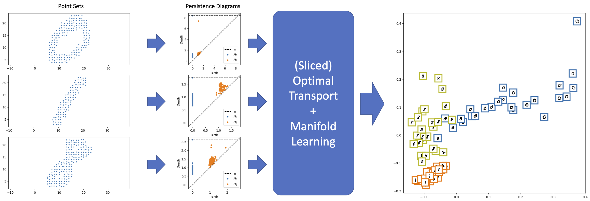

# TopoTrans: Optimal Transport meets Topological Data Analysis

This repository contains the ISBI2023 tutorial on Optimal Transport for Topological Data Analysis. The tutorial is under TDA_OT.ipynb and the code is execultable on [Google Colab](https://colab.research.google.com/github/skolouri/TopoTrans/blob/main/TDA_OT.ipynb). 

